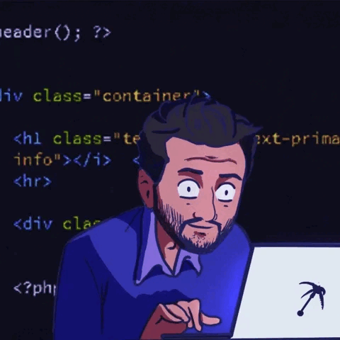

    
    <h1 align="center">Hi 👋, I'm Oscar</h1>
    <h3 align="center">A passionate fullstack web developer from Uruguay.</h3>

---

### 👨‍💻 About Me :

- 📝 "Studying to become a Full Stack Web Developer"

- 📫 How to reach me **Ocharlo14@gmail.com**

- 🌱 I’m currently learning

    <h3>💻 Languages:</h3>
        

            &nbsp;
            &nbsp;
            &nbsp;
            &nbsp;
            &nbsp;
            &nbsp;
            &nbsp;
            &nbsp;            
        

    <h3>🔨 Tools:</h3>
        

        &nbsp;
        &nbsp;
        &nbsp;
        &nbsp;
        &nbsp;
        &nbsp;
      

---

### 📊 My Stats :

